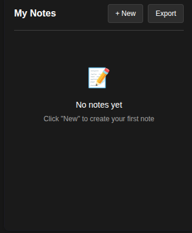

# Notes Extension

A simple and elegant Chrome/Firefox browser extension for creating, managing, and organizing your personal notes directly in your browser.



## ✨ Features

- **📝 Create Notes**: Add new notes with title and content
- **✏️ Edit Notes**: Modify existing notes with full editing capabilities
- **🗑️ Delete Notes**: Remove notes with confirmation dialog for safety
- **📋 Copy Content**: Copy note content to clipboard with one click
- **📤 Export Notes**: Export all notes to JSON format for backup
- **🔍 View Management**: Clean list view and detailed note view
- **🌙 Dark Mode**: Automatic dark mode support based on system preference
- **💾 Local Storage**: All notes stored locally in browser storage
- **📱 Responsive Design**: Clean, modern UI that works in extension popup
- **⌨️ Accessibility**: Full keyboard navigation and screen reader support

## 🚀 Installation

### For Development/Testing

1. **Clone or download** this repository to your local machine

2. **Chrome/Chromium browsers:**
   - Open Chrome and navigate to `chrome://extensions/`
   - Enable "Developer mode" in the top right
   - Click "Load unpacked" and select the extension folder

3. **Firefox:**
   - Open Firefox and navigate to `about:debugging`
   - Click "This Firefox" → "Load Temporary Add-on"
   - Select the `manifest.json` file from the extension folder

### For End Users

> Note: This extension is not yet published to the Chrome Web Store or Firefox Add-ons. Installation requires developer mode for now.

## 🎯 Usage

### Creating a Note
1. Click the extension icon in your browser toolbar
2. Click the "+ New" button in the popup
3. Enter a title and content for your note
4. Click "Save Note" to store it

### Managing Notes
- **View Notes**: All notes are displayed in a clean list format, sorted by creation date
- **Edit Notes**: Click on any note to view details, then click "Edit" to modify
- **Delete Notes**: Use the delete button with confirmation dialog
- **Copy Content**: Quickly copy note content to clipboard
- **Export Data**: Use the "Export" button to download all notes as JSON

### Keyboard Shortcuts
- `Tab` - Navigate through interface elements
- `Enter` - Activate buttons and form elements
- `Escape` - Close dialogs and return to notes list

## 🛠️ Technical Details

### Architecture
- **Manifest Version**: 3 (latest Chrome extension standard)
- **Storage**: Chrome's local storage API for data persistence
- **Frontend**: Vanilla JavaScript, HTML5, and CSS3
- **UI Framework**: Custom CSS with CSS custom properties
- **Icons**: Multiple sizes for different contexts (16px, 32px, 48px, 128px)

### File Structure
```
ia-prompts-extension/
├── manifest.json          # Extension configuration
├── popup.html            # Main popup interface
├── popup.js              # Core functionality and logic
├── popup.css             # Styles and responsive design
├── icons/                # Extension icons
│   ├── favicon-16x16.png
│   ├── favicon-32x32.png
│   ├── android-icon-48x48.png
│   └── android-icon-192x192.png
├── screenshot.png        # Extension preview image
└── README.md            # This documentation
```

### Permissions
- `storage` - Required for persisting notes locally

### Browser Compatibility
- ✅ Chrome 88+
- ✅ Chromium-based browsers (Edge, Brave, etc.)
- ✅ Firefox 89+ (with manifest v2 compatibility)
- ✅ Other Chromium-based browsers

## 🎨 Design Features

### Visual Design
- **Modern UI**: Clean, minimalist interface following Material Design principles
- **Consistent Spacing**: 8px grid system for consistent layout
- **Color Palette**: Professional blue (#4285f4) primary color with semantic colors
- **Typography**: System font stack for optimal readability
- **Shadows**: Subtle elevation with CSS box-shadows

### Dark Mode Support
- Automatic detection of system dark mode preference
- Seamless transition between light and dark themes
- Maintained contrast ratios for accessibility

### Responsive Elements
- Fixed popup width (320px) optimized for browser extensions
- Flexible height based on content
- Smooth animations and transitions
- Touch-friendly button sizes

## 🔒 Privacy & Security

- **Local Storage Only**: All data stays on your device
- **No Network Requests**: No data transmission to external servers
- **No Analytics**: No tracking or user behavior monitoring
- **Safe Permissions**: Only requests storage permission, nothing else
- **XSS Protection**: Input sanitization to prevent script injection

## 📊 Data Format

### Note Object Structure
```json
{
  "id": "1640995200000",
  "title": "My Note Title",
  "content": "Note content goes here...",
  "createdAt": "2021-12-31T23:00:00.000Z",
  "updatedAt": "2021-12-31T23:00:00.000Z"
}
```

### Export Format
```json
{
  "exportDate": "2021-12-31T23:00:00.000Z",
  "totalNotes": 5,
  "notes": [...]
}
```

## 🚧 Development

### Local Development Setup
1. Clone the repository
2. Make your changes to the source files
3. Test in browser using "Load unpacked" or "Load Temporary Add-on"
4. Submit issues and pull requests as needed

### Building for Production
No build process required - this is a pure web extension using vanilla technologies.

### Code Quality
- Clean, commented JavaScript
- Modular class-based architecture
- CSS custom properties for theming
- Semantic HTML structure
- Accessible design patterns

## 🐛 Troubleshooting

### Common Issues

**Extension not loading:**
- Ensure Developer Mode is enabled
- Check that manifest.json is valid JSON
- Look for errors in Chrome's extension console

**Notes not saving:**
- Check if storage permission is granted
- Ensure browser has available storage space
- Try refreshing the extension

**Styling issues:**
- Clear browser cache and reload extension
- Check for CSS syntax errors
- Verify popup dimensions aren't restricted

### Debug Mode
Open Chrome DevTools on the popup by:
1. Right-clicking the extension popup
2. Select "Inspect" or "Inspect Element"
3. Check console for error messages

## 📝 Contributing

We welcome contributions! Please feel free to submit issues and enhancement requests.

### Development Guidelines
- Follow existing code style and patterns
- Test thoroughly across different browsers
- Update documentation for new features
- Ensure accessibility standards are maintained

## 📄 License

This project is open source and available under the [MIT License](LICENSE).

## 🙏 Acknowledgments

- Icons generated for multiple device sizes
- CSS framework inspired by modern design systems
-感谢所有为开源项目贡献的开发者们

## 📞 Support

If you encounter any issues or have questions:

1. Check the troubleshooting section above
2. Search existing issues in the repository
3. Create a new issue with detailed information
4. Include browser version and operating system details

---

**Made with ❤️ for better note-taking in your browser**